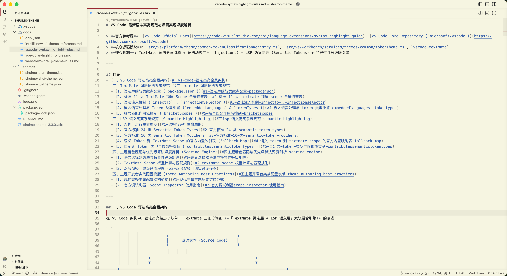
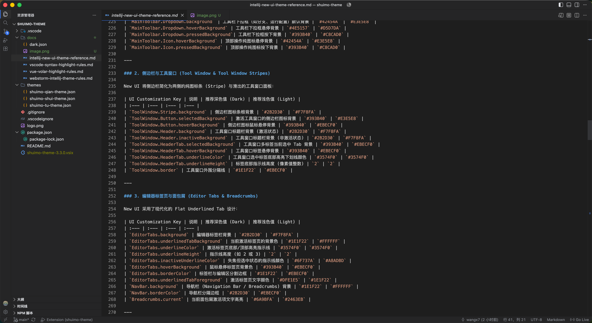
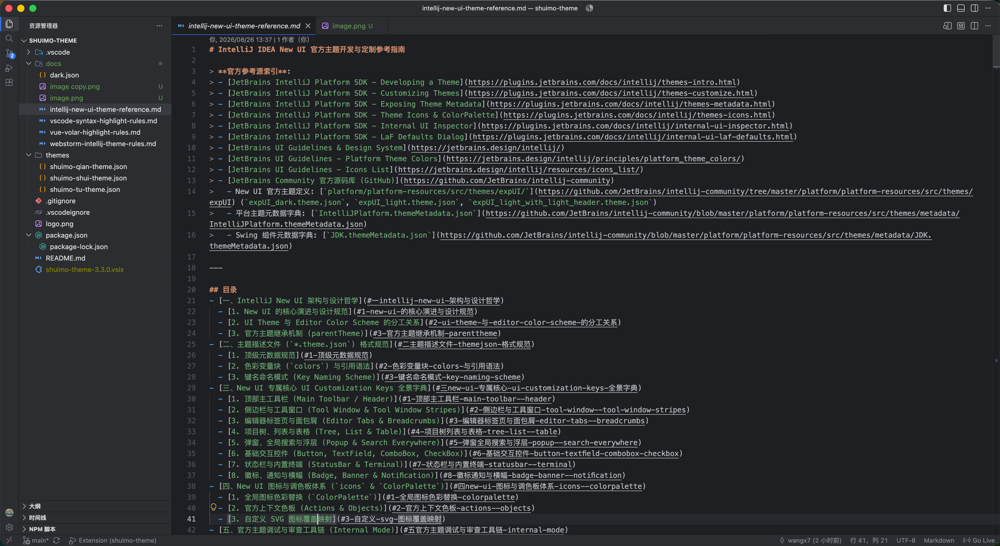

# 水墨 Theme (Shuimo Theme)

几抹淡墨涵万象，一帧素宣蕴乾坤。

一款精心打磨的高雅代码配色主题扩展。

## 包含主题

1. **水墨 · 浅 (Shuimo Light)**：素宣底色（#F6F5E1）、浓淡墨色、朱砂红关键字与指示条、黛蓝常量与字符串、苍翠绿注释，典雅质朴。

   

2. **水墨 · 土 (Shuimo Earth)**：基于 JetBrains 最新 **IntelliJ New UI (Dark)** 沉稳配色体系（#1E1F22 编辑器底色、#2B2D30 工作台背景、#3574F0 品牌蓝指示），现代精致。

   

3. **水墨 · 水 (Shuimo Water)**：基于 **VS Code 经典 Dark+** 深色配色体系（#1E1E1E 编辑器底色、#252526 工作台背景），润物无声，清晰自然。

   

## 使用

1. 在扩展市场搜索并安装 `水墨 Theme`。
2. 按快捷键 `Ctrl+Shift+P`（Mac 为 `Cmd+Shift+P`），输入 `Preferences: Color Theme`。
3. 选择对应主题（`水墨 · 浅`、`水墨 · 土` 或 `水墨 · 水`）。